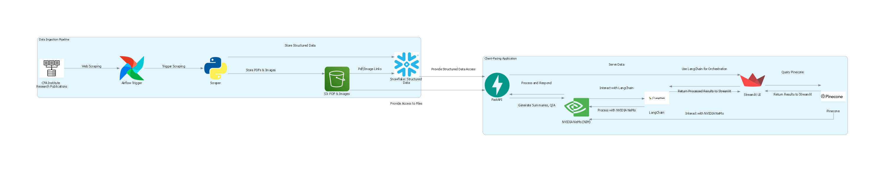

# Assignment-3
---

# Assignment 3: Interactive Research Platform for CFA Research Publications

## Project Overview
This project involves creating a comprehensive data pipeline and interactive application centered on the CFA Institute Research Foundation Publications. The first part focuses on data ingestion: scraping publication details such as titles, images, brief summaries, and PDF files, then storing the images and PDFs in AWS S3 and the structured data in a Snowflake database. Automation is achieved using Airflow pipelines to streamline the scraping and storage processes. The second part entails developing a client-facing application using FastAPI and Streamlit, which allows users to explore the stored documents through a user-friendly interface. Features include on-the-fly summary generation using NVIDIA services and a multi-modal Retrieval-Augmented Generation (RAG) system for interactive Q&A sessions without exchanging full documents.

## Data Flow and Architecture
Below is an overview of the data flow and ETL architecture used in the project:



## Live Application Links
- **Deployed Application**: [Streamlit App Link]
- **Google Codelabs**: [[code labs](https://codelabs-preview.appspot.com/?file_id=https://docs.google.com/document/d/1IhIWrIgB9EdNE-lYjc7TGw0_5eD7awxhBJDtC-qR8gE/edit?tab=t.0#2)]
- **GitHub Repository**: [[GitHub Repo Link](https://github.com/BigData-saturdayT2/Assignment3)]

## Problem Statement
The primary goal of this project is to develop an automated data pipeline, that scrapes data and build an interactive platform that enables efficient exploration, summarization, and querying of CFA Institute Research Foundation Publications data using advanced AI technologies.

## Technologies and Their Roles:
- **Apache Airflow**: Automates the data ingestion pipeline, including scraping publication data and uploading assets to AWS S3.
- **AWS S3**: Serves as the storage solution for images and PDF files extracted from the CFA Institute Research Foundation Publications.
- **Snowflake**: Acts as the cloud-based data warehouse to store structured data such as titles, summaries, and links to images and PDFs.
- **FastAPI**: Employed to develop the backend API that allows users to explore and interact with the stored documents.
- **Streamlit**: Used to build a user-friendly interface for document selection, summary generation, and interactive Q&A functionalities.
- **NVIDIA APIs**: Provide backend services for language models used in summary generation and multi-modal Retrieval-Augmented Generation (RAG) for interactive Q&A sessions.
- **LangChain**: Utilized for summary generation by integrating with NVIDIA APIs to leverage advanced language models for efficient and accurate document summaries.
- **Multi-modal Retrieval-Augmented Generation (RAG)**: Implemented to enable efficient querying of documents based on user inputs without the need to exchange full documents.
- **Docker**: Facilitates containerization of applications to ensure consistent deployment across various environments.
- **Docker Compose**: Simplifies the deployment process by managing multiple containers (FastAPI and Streamlit applications) together.

## Repository Structure
```
├── Streamlit/                          # Streamlit application for frontend UI
├── fastapi/                            # FastAPI backend for user management and API services
├── images/                             # Project images and architecture diagrams
├── pipelines/                          # Airflow pipelines for PDF processing (PyPDF2 & IBM Watson)
├── .gitignore                          # Git ignore file
├── LICENSE                             # License information
├── README.md                           # Project documentation file
├── airflow_etl.ipynb                   # Jupyter notebook for ETL pipeline walkthrough
├── requirements.txt                    # Dependencies required for the project
└── s3_hf_gaia_data.py                  # Script for handling S3 data transfers
```

## Instructions for Running Locally
1. **Clone the repository**:
   ```bash
   git clone https://github.com/your-repo-name.git
   cd your-repo-name
   ```
2. **Create a virtual environment**:
   ```bash
   conda create --name myenv
   conda activate myenv
   ```
3. **Install the requirements**:
   ```bash
   pip install -r requirements.txt
   ```
4. **Run the Streamlit application(in a separate terminal)**:
   ```bash
   cd streamlit 
   streamlit run app.py
   ```
5. **Run the Fastapi application(in a separate terminal)**:
   ```bash
   cd fastapi
   uvicorn main:app --reload
   ```

## Deployment
The application is containerized using Docker Compose. Run the following command to deploy:
```bash
docker-compose up
```

## Documentation
- **Codelabs**: [[Codelabs](https://codelabs-preview.appspot.com/?file_id=11XVdlzZ8DJotFKU9-hZb4OrUASjitlK7xsWqiVxxNzg#0)]
- **Video Walkthrough**: [Video Link]

## Contribution
All team members contributed equally to this project.
WE ATTEST THAT WE HAVEN’T USED ANY OTHER STUDENTS’ WORK IN OUR
ASSIGNMENT AND ABIDE BY THE POLICIES LISTED IN THE STUDENT HANDBOOK

| Name     | Work Done                                                                                           |
|----------|-----------------------------------------------------------------------------------------------------|
| Abhinav  | Worked on Streamlit, Dockerizing Streamlit and FastAPI, Multimodal RAGs, NVIDIA models, Pinecone            | 
| Dheer    | Worked on FastAPI, NVIDIA models, Airflow dags, Documentation, Architecture Diagram                  |
| Nishita  | Worked on web scraping, Airflow Dags, S3 and Snowflake setup, Multimodal RAGs, NVIDIA models, Documentation |
